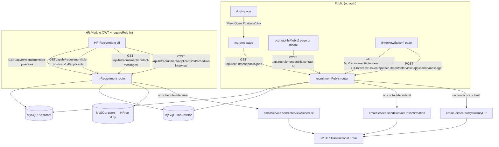
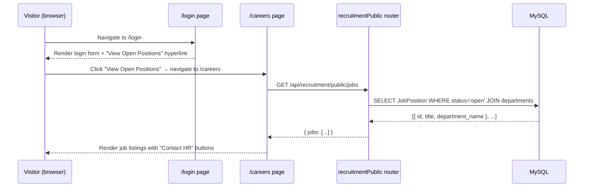
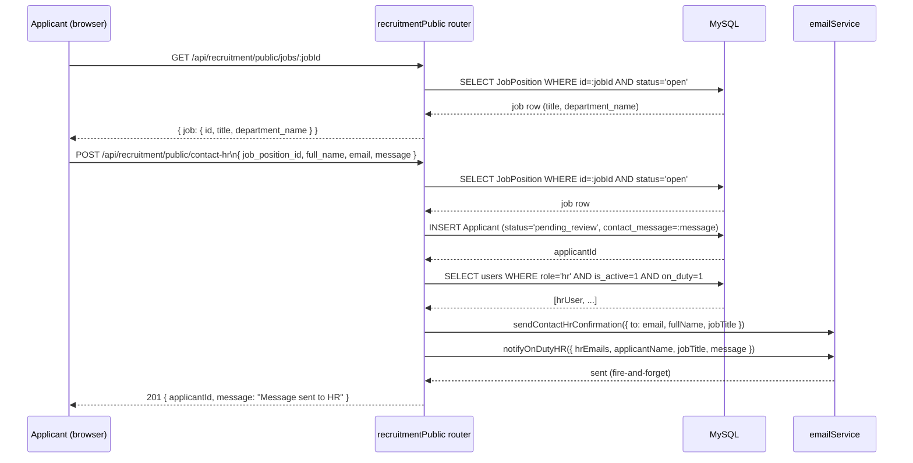
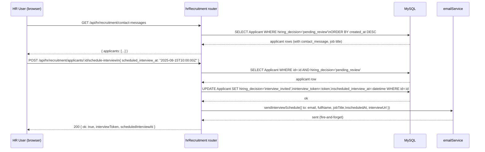
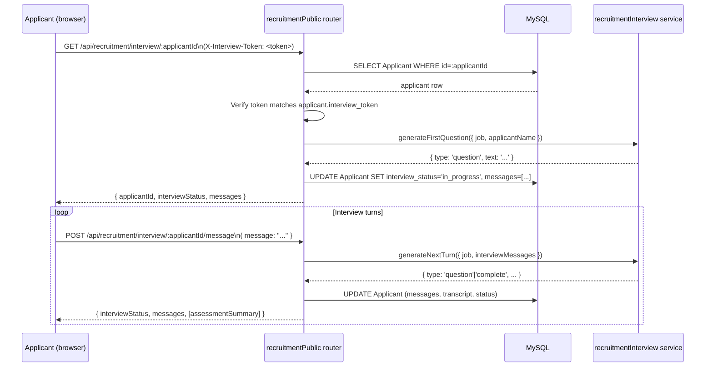

# Design Document: Public Job Application Flow

## Overview

This feature adds a fully public-facing job application flow to AWLMS. A public `/careers` page
lists all open `JobPosition` records (no login required). Each listing has a "Contact HR" button
that opens a contact form collecting the applicant's name, email, and a message. On submission
the system stores the applicant with status `pending_review`, notifies all on-duty HR personnel
by email, and sends the applicant an automated confirmation email.

HR personnel see incoming contact messages in the HR Recruitment module. HR manually picks an
interview date/time and sends the applicant an email containing the scheduled time and a unique
one-time link (`/interview/[token]`). The applicant's status advances to `interview_invited`.
The AI interview page (`/interview/[token]`) already exists and requires no login.

The login page (`/login`) gains a visible "View Open Positions" hyperlink below the sign-in
button, giving unauthenticated visitors a direct path to the careers page.

The feature extends the existing `Applicant` table and `recruitmentPublic` / `hrRecruitment`
routes. Email delivery is handled by a new `emailService` wrapping Nodemailer. The previous
`/apply/[jobId]` self-serve form (which immediately started an AI interview) is replaced by
this contact-HR flow as the primary public application path.

---

## Architecture



---

## Sequence Diagrams

### 1. Visitor Discovers Open Positions via Login Page



### 2. Applicant Submits Contact-HR Form



### 3. HR Reviews Contact Messages and Schedules Interview



### 4. Applicant Accesses AI Interview via Token



---

## Components and Interfaces

### Component 1: Login Page — Frontend Change

**Purpose**: Surface the careers page to unauthenticated visitors.

**Change**: Add a "View Open Positions" hyperlink below the sign-in button on the `/login` page.

```
[Sign In button]
──────────────────────────────
View Open Positions  ← new hyperlink → navigates to /careers
```

**Responsibilities**:
- Render as a plain anchor (`<a href="/careers">`) or router `<Link>` — no auth required
- Visible to all visitors regardless of login state
- Styled consistently with the existing login page design

---

### Component 2: `recruitmentPublic` Router (extended)

**Purpose**: Serves all public, unauthenticated endpoints for job listing, contact-HR submission,
and AI interview interaction.

**New / changed endpoints**:

```
GET  /api/recruitment/public/jobs
     → NEW: list all JobPositions with status='open', return id, title, department_name

GET  /api/recruitment/public/jobs/:id
     → already exists; add department_name to response

POST /api/recruitment/public/contact-hr
     → NEW: replaces /apply as primary public path
       accepts { job_position_id, full_name, email, message }
       stores Applicant with hiring_decision='pending_review', contact_message=:message
       emails applicant confirmation + notifies all on-duty HR personnel

GET  /api/recruitment/interview/:applicantId
     → already exists (token via X-Interview-Token header); no change needed

POST /api/recruitment/interview/:applicantId/message
     → already exists; no change needed
```

**Note**: The legacy `POST /api/recruitment/apply` endpoint (which immediately starts an AI
interview) remains in the codebase for backward compatibility but is no longer the primary
public path. New frontend flows use `POST /api/recruitment/public/contact-hr`.

**Responsibilities**:
- Validate all inputs; return 400 on missing required fields
- Enforce job `status = 'open'` before accepting contact submissions
- Resolve on-duty HR users at submission time for notification targeting
- Fire-and-forget email calls (log errors, never block response)

---

### Component 3: `hrRecruitment` Router (extended)

**Purpose**: Authenticated HR endpoints for managing job positions, viewing contact messages,
and scheduling interviews.

**New endpoints**:

```
GET  /api/hr/recruitment/contact-messages
     → NEW: list all applicants with hiring_decision='pending_review'
       returns id, full_name, email, contact_message, job_title, created_at
       ordered by created_at DESC

GET  /api/hr/recruitment/job-positions/:id/applicants
     → NEW: list all applicants for a specific job posting (any status)

POST /api/hr/recruitment/applicants/:id/schedule-interview
     → NEW: replaces invite-interview
       body: { scheduled_interview_at: ISO-8601 datetime string }
       generates interview_token, sets scheduled_interview_at, advances status
       sends applicant email with date/time + interview link
```

**Responsibilities**:
- Require valid JWT + `role = 'hr'` (enforced by server.js middleware)
- Only schedule interviews for applicants with `hiring_decision = 'pending_review'`
- Generate a cryptographically random 64-hex-char token
- Validate `scheduled_interview_at` is a valid future datetime
- Idempotency: return 409 if applicant is already in `interview_invited` or later status

---

### Component 4: `emailService` (new service)

**Purpose**: Centralised email dispatch. Wraps Nodemailer. All methods are fire-and-forget.

**Interface**:

```javascript
// services/emailService.js

/**
 * Confirm to the applicant that their contact message was received.
 * @param {{ to: string, fullName: string, jobTitle: string }} opts
 */
async function sendContactHrConfirmation({ to, fullName, jobTitle }) {}

/**
 * Notify all on-duty HR personnel of a new contact message.
 * @param {{ hrEmails: string[], applicantName: string, jobTitle: string, message: string }} opts
 */
async function notifyOnDutyHR({ hrEmails, applicantName, jobTitle, message }) {}

/**
 * Send the applicant their scheduled interview date/time and one-time link.
 * @param {{ to: string, fullName: string, jobTitle: string,
 *           scheduledAt: string, interviewUrl: string }} opts
 */
async function sendInterviewSchedule({ to, fullName, jobTitle, scheduledAt, interviewUrl }) {}

module.exports = { sendContactHrConfirmation, notifyOnDutyHR, sendInterviewSchedule };
```

**Responsibilities**:
- Read SMTP config from environment variables (`SMTP_HOST`, `SMTP_PORT`, `SMTP_USER`,
  `SMTP_PASS`, `SMTP_FROM`, `FRONTEND_ORIGIN`)
- No-op gracefully when SMTP is not configured (log warning, resolve without throwing)
- Log and swallow transport errors (never throw to caller)
- Compose plain-text + HTML email bodies from inline templates

---

## Data Models

### Applicant Table — New / Changed Columns

The existing `Applicant` table is extended with new columns and new status values. The existing
`interview_token`, `interview_status`, `interview_messages`, `interview_transcript`,
`assessment_summary`, and `ai_recommendation` columns are unchanged.

```sql
-- Migration 012: public contact-HR flow additions

ALTER TABLE `Applicant`
  -- Contact message submitted by the applicant via the Contact HR form
  ADD COLUMN IF NOT EXISTS `contact_message` TEXT NULL
    COMMENT 'Free-text message to HR submitted via the Contact HR form'
    AFTER `application_details`,

  -- Scheduled interview datetime set by HR when sending the interview invitation
  ADD COLUMN IF NOT EXISTS `scheduled_interview_at` DATETIME NULL
    COMMENT 'Interview date/time chosen by HR and communicated to the applicant'
    AFTER `contact_message`,

  -- Extend hiring_decision to include the new public-flow statuses
  MODIFY COLUMN `hiring_decision`
    ENUM('pending','pending_review','under_review','approved','rejected','withdrawn','interview_invited')
    NOT NULL DEFAULT 'pending'
    COMMENT 'pending_review: contact submitted, awaiting HR; interview_invited: HR scheduled interview';

-- Index to support HR inbox query (pending_review applicants ordered by date)
ALTER TABLE `Applicant`
  ADD INDEX IF NOT EXISTS `idx_applicant_hiring_decision_job`
    (`job_position_id`, `hiring_decision`);
```

**Status lifecycle**:
```
pending          (legacy — old /apply flow)
pending_review   ← contact-HR form submitted; HR notified
interview_invited ← HR scheduled interview; token + datetime set; email sent
under_review     ← AI interview completed; assessment ready for HR
approved | rejected ← HR final decision
```

**Design note**: `contact_message` stores the applicant's initial message verbatim.
`scheduled_interview_at` is set by HR at the same time as `interview_token`, so both are
always either both NULL or both set for `interview_invited` applicants.

---

### JobPosition Table — No Schema Changes

The `JobPosition` table already has `id`, `title`, `description`, `department_id`, and `status`.
The careers page lists positions by `status = 'open'` with a JOIN to `departments` for the
department name — no new columns needed.

---

### HR On-Duty Resolution

On-duty HR personnel are resolved at contact-submission time by querying:

```sql
SELECT id, email, full_name
FROM users
WHERE role = 'hr'
  AND is_active = 1
ORDER BY created_at ASC
```

**Note**: The current schema does not have an explicit `on_duty` / `on_schedule` flag on the
`users` table. Until a scheduling module is added, "on-duty HR" is defined as all active HR
users (`role = 'hr' AND is_active = 1`). This query can be tightened once an HR scheduling
feature is implemented.

---

### Email Configuration (Environment Variables)

```
SMTP_HOST=smtp.example.com
SMTP_PORT=587
SMTP_SECURE=false          # true for port 465
SMTP_USER=noreply@example.com
SMTP_PASS=secret
SMTP_FROM="AWLMS <noreply@example.com>"
FRONTEND_ORIGIN=https://app.example.com   # used to build /interview/<token> URLs
```

---

## Algorithmic Pseudocode

### Algorithm 1: listOpenJobs (public)

```pascal
PROCEDURE listOpenJobs(req, res)
  INPUT: (none — no auth, no params)
  OUTPUT: HTTP 200 { jobs: [...] }

  BEGIN
    rows ← DB.query(
      'SELECT jp.id, jp.title, d.name AS department_name
       FROM JobPosition jp
       LEFT JOIN departments d ON d.id = jp.department_id
       WHERE jp.status = "open"
       ORDER BY jp.created_at DESC'
    )
    RETURN 200 { jobs: rows }
  END
END PROCEDURE
```

**Preconditions:** Database connection is available
**Postconditions:** Returns array of open positions (may be empty); never 404

---

### Algorithm 2: submitContactHr (public)

```pascal
PROCEDURE submitContactHr(req, res)
  INPUT: req.body = { job_position_id, full_name, email, message }
  OUTPUT: HTTP 201 { applicantId } | HTTP 4xx/5xx error

  BEGIN
    // 1. Validate required fields
    jobPositionId ← trim(req.body.job_position_id)
    fullName      ← trim(req.body.full_name)
    email         ← trim(lowercase(req.body.email))
    message       ← trim(req.body.message)

    IF jobPositionId = '' OR fullName = '' OR email = '' OR message = '' THEN
      RETURN 400 { error: 'job_position_id, full_name, email, and message are required' }
    END IF

    IF NOT isValidEmail(email) THEN
      RETURN 400 { error: 'Invalid email address' }
    END IF

    // 2. Verify job is open
    job ← DB.query(
      'SELECT id, title, status FROM JobPosition WHERE id = ? LIMIT 1',
      [jobPositionId]
    )
    IF job IS NULL OR job.status ≠ 'open' THEN
      RETURN 404 { error: 'Job not found or not accepting applications' }
    END IF

    // 3. Insert applicant
    applicantId ← UUID()
    TRY
      DB.query(
        'INSERT INTO Applicant
           (id, job_position_id, full_name, email, contact_message, hiring_decision, interview_status)
         VALUES (?, ?, ?, ?, ?, "pending_review", "pending_start")',
        [applicantId, jobPositionId, fullName, email, message]
      )
    CATCH DuplicateEntry
      RETURN 409 { error: 'You have already contacted HR for this position with this email.' }
    END TRY

    // 4. Resolve on-duty HR personnel
    hrUsers ← DB.query(
      'SELECT email FROM users WHERE role = "hr" AND is_active = 1'
    )
    hrEmails ← hrUsers.map(u => u.email)

    // 5. Send emails (fire-and-forget)
    emailService.sendContactHrConfirmation({
      to: email, fullName, jobTitle: job.title
    }).catch(err => console.error('Email error:', err))

    IF hrEmails.length > 0 THEN
      emailService.notifyOnDutyHR({
        hrEmails, applicantName: fullName, jobTitle: job.title, message
      }).catch(err => console.error('HR notify error:', err))
    END IF

    RETURN 201 { applicantId, message: 'Message sent to HR' }
  END
END PROCEDURE
```

**Preconditions:**
- `job_position_id`, `full_name`, `email`, `message` are non-empty strings
- Database connection is available

**Postconditions:**
- A new `Applicant` row exists with `hiring_decision = 'pending_review'` and `contact_message` set
- Applicant receives a confirmation email (best-effort)
- All active HR users receive a notification email (best-effort)
- Response is 201 with `applicantId`

**Loop Invariants:** N/A

### Algorithm 3: scheduleInterview (HR action)

```pascal
PROCEDURE scheduleInterview(req, res)
  INPUT: req.params.id = applicantId,
         req.body = { scheduled_interview_at: ISO-8601 string },
         req.user = { id, role: 'hr' }
  OUTPUT: HTTP 200 { ok, interviewToken, scheduledInterviewAt } | HTTP 4xx/5xx error

  BEGIN
    applicantId      ← req.params.id
    scheduledAtRaw   ← req.body.scheduled_interview_at

    // 1. Validate scheduled datetime
    IF scheduledAtRaw IS NULL OR scheduledAtRaw = '' THEN
      RETURN 400 { error: 'scheduled_interview_at is required' }
    END IF

    scheduledAt ← parseISO(scheduledAtRaw)
    IF scheduledAt IS INVALID THEN
      RETURN 400 { error: 'scheduled_interview_at must be a valid ISO-8601 datetime' }
    END IF

    IF scheduledAt ≤ NOW() THEN
      RETURN 400 { error: 'scheduled_interview_at must be a future datetime' }
    END IF

    // 2. Load applicant
    row ← DB.query(
      'SELECT a.id, a.full_name, a.email, a.hiring_decision,
              jp.title AS job_title
       FROM Applicant a
       INNER JOIN JobPosition jp ON jp.id = a.job_position_id
       WHERE a.id = ? LIMIT 1',
      [applicantId]
    )

    IF row IS NULL THEN
      RETURN 404 { error: 'Applicant not found' }
    END IF

    // 3. Guard: only schedule for pending_review applicants
    IF row.hiring_decision ≠ 'pending_review' THEN
      RETURN 409 { error: 'Applicant is not in pending_review status' }
    END IF

    // 4. Generate unique interview token
    interviewToken ← crypto.randomBytes(32).toString('hex')  // 64 hex chars

    // 5. Update applicant record atomically
    DB.query(
      'UPDATE Applicant
       SET hiring_decision = "interview_invited",
           interview_token = ?,
           scheduled_interview_at = ?,
           updated_at = CURRENT_TIMESTAMP
       WHERE id = ? AND hiring_decision = "pending_review"',
      [interviewToken, scheduledAt, applicantId]
    )

    // 6. Build interview URL and send schedule email (fire-and-forget)
    interviewUrl ← FRONTEND_ORIGIN + '/interview/' + interviewToken
    emailService.sendInterviewSchedule({
      to: row.email,
      fullName: row.full_name,
      jobTitle: row.job_title,
      scheduledAt: scheduledAt.toISOString(),
      interviewUrl
    }).catch(err => console.error('Email error:', err))

    RETURN 200 { ok: true, interviewToken, scheduledInterviewAt: scheduledAt.toISOString() }
  END
END PROCEDURE
```

**Preconditions:**
- Caller is authenticated as `role = 'hr'`
- `applicantId` is a valid UUID present in the database
- `scheduled_interview_at` is a valid ISO-8601 datetime in the future
- Applicant's `hiring_decision = 'pending_review'`

**Postconditions:**
- `Applicant.hiring_decision = 'interview_invited'`
- `Applicant.interview_token` is set to a unique 64-char hex string
- `Applicant.scheduled_interview_at` is set to the chosen datetime
- An email with the schedule and interview link is dispatched (best-effort)

**Loop Invariants:** N/A

---

### Algorithm 4: listContactMessages (HR)

```pascal
PROCEDURE listContactMessages(req, res)
  INPUT: req.query.job_position_id? = optional filter
  OUTPUT: HTTP 200 { applicants: [...] }

  BEGIN
    sql ← 'SELECT a.id, a.full_name, a.email, a.contact_message,
                   a.hiring_decision, a.created_at, a.updated_at,
                   jp.id AS job_position_id, jp.title AS job_title
            FROM Applicant a
            INNER JOIN JobPosition jp ON jp.id = a.job_position_id
            WHERE a.hiring_decision = "pending_review"'
    params ← []

    IF req.query.job_position_id IS NOT NULL THEN
      sql ← sql + ' AND a.job_position_id = ?'
      params.push(req.query.job_position_id)
    END IF

    sql ← sql + ' ORDER BY a.created_at DESC LIMIT 200'

    rows ← DB.query(sql, params)
    RETURN 200 { applicants: rows }
  END
END PROCEDURE
```

**Preconditions:** Caller is authenticated as `role = 'hr'`
**Postconditions:** Returns up to 200 pending-review applicants; empty array if none

---

## Key Functions with Formal Specifications

### `emailService.sendContactHrConfirmation(opts)`

```javascript
/**
 * @param {{ to: string, fullName: string, jobTitle: string }} opts
 * @returns {Promise<void>}
 */
async function sendContactHrConfirmation({ to, fullName, jobTitle })
```

**Preconditions:**
- `to` is a non-empty, syntactically valid email address
- `fullName` and `jobTitle` are non-empty strings

**Postconditions:**
- An email is dispatched to `to` confirming the message was received
- Body informs applicant that HR will be in touch with interview details
- Function resolves without throwing (errors logged internally)

---

### `emailService.notifyOnDutyHR(opts)`

```javascript
/**
 * @param {{ hrEmails: string[], applicantName: string,
 *           jobTitle: string, message: string }} opts
 * @returns {Promise<void>}
 */
async function notifyOnDutyHR({ hrEmails, applicantName, jobTitle, message })
```

**Preconditions:**
- `hrEmails` is a non-empty array of valid email addresses
- `applicantName`, `jobTitle`, `message` are non-empty strings

**Postconditions:**
- An email is dispatched to each address in `hrEmails`
- Body contains `applicantName`, `jobTitle`, and the full `message` text
- Function resolves without throwing

---

### `emailService.sendInterviewSchedule(opts)`

```javascript
/**
 * @param {{ to: string, fullName: string, jobTitle: string,
 *           scheduledAt: string, interviewUrl: string }} opts
 * @returns {Promise<void>}
 */
async function sendInterviewSchedule({ to, fullName, jobTitle, scheduledAt, interviewUrl })
```

**Preconditions:**
- `to` is a valid email address
- `scheduledAt` is a valid ISO-8601 datetime string
- `interviewUrl` is a fully-qualified URL containing the one-time token
- `fullName` and `jobTitle` are non-empty strings

**Postconditions:**
- An email is dispatched to `to` containing the formatted `scheduledAt` date/time
  and `interviewUrl` as a clickable link
- Function resolves without throwing

---

### `isValidEmail(email)` (input validation helper)

```javascript
/**
 * @param {string} email
 * @returns {boolean}
 */
function isValidEmail(email)
```

**Preconditions:** `email` is a string (may be empty)

**Postconditions:**
- Returns `true` if and only if `email` matches a basic RFC-5322 pattern
  (contains `@`, has non-empty local and domain parts)
- Returns `false` for empty strings, strings without `@`, or strings with spaces

**Loop Invariants:** N/A (single regex test)

---

## Example Usage

### Fetching Open Jobs for the Careers Page

```javascript
// GET all open positions
const { jobs } = await fetch('/api/recruitment/public/jobs').then(r => r.json())
// jobs = [{ id, title, department_name }, ...]
// Render each with a "Contact HR" button linking to /contact-hr/<id>
```

### Submitting the Contact-HR Form

```javascript
// POST contact message
const res = await fetch('/api/recruitment/public/contact-hr', {
  method: 'POST',
  headers: { 'Content-Type': 'application/json' },
  body: JSON.stringify({
    job_position_id: jobId,
    full_name: 'Jane Smith',
    email: 'jane@example.com',
    message: 'I am very interested in this role. I have 8 years of experience in...'
  })
})
const { applicantId } = await res.json()
// → Applicant stored with hiring_decision='pending_review', contact_message set
// → Confirmation email sent to jane@example.com
// → All active HR users notified by email
```

### HR Viewing Contact Messages

```javascript
// List all pending contact messages
const { applicants } = await fetch(
  '/api/hr/recruitment/contact-messages',
  { headers: { Authorization: `Bearer ${hrToken}` } }
).then(r => r.json())
// applicants = [{ id, full_name, email, contact_message, job_title, created_at }, ...]
```

### HR Scheduling an Interview

```javascript
// Schedule interview for a specific applicant
const { interviewToken, scheduledInterviewAt } = await fetch(
  `/api/hr/recruitment/applicants/${applicantId}/schedule-interview`,
  {
    method: 'POST',
    headers: {
      Authorization: `Bearer ${hrToken}`,
      'Content-Type': 'application/json'
    },
    body: JSON.stringify({ scheduled_interview_at: '2025-08-15T10:00:00Z' })
  }
).then(r => r.json())
// → applicant.hiring_decision = 'interview_invited'
// → applicant.scheduled_interview_at = '2025-08-15T10:00:00.000Z'
// → Email sent to applicant with date/time + link: /interview/<interviewToken>
```

### Applicant Accessing the Interview Page

```javascript
// The /interview/[token] page resolves applicantId from the token server-side,
// then uses the existing token-header pattern:
const session = await fetch(`/api/recruitment/interview/${applicantId}`, {
  headers: { 'X-Interview-Token': token }
}).then(r => r.json())
// session = { interviewStatus: 'in_progress', messages: [{ role: 'assistant', content: '...' }] }
```

---

## Correctness Properties

1. **Application uniqueness**: For all applicants `a`, no two rows in `Applicant` share the same
   `(job_position_id, email)` pair. Enforced by `UNIQUE KEY uk_applicant_position_email`.

2. **Token uniqueness**: For all applicants `a` where `a.interview_token IS NOT NULL`,
   `a.interview_token` is globally unique across the `Applicant` table.
   Enforced by `UNIQUE KEY uk_applicant_interview_token`.

3. **Token only set on schedule**: For all applicants `a`,
   `a.interview_token IS NOT NULL` implies
   `a.hiring_decision IN ('interview_invited', 'under_review', 'approved', 'rejected')`.
   Enforced by `scheduleInterview` which only sets the token when transitioning from
   `pending_review`.

4. **Schedule datetime co-presence**: For all applicants `a`,
   `a.interview_token IS NOT NULL` if and only if `a.scheduled_interview_at IS NOT NULL`.
   Both are set atomically in the same `UPDATE` statement.

5. **Scheduled datetime is future at time of scheduling**: For all calls to
   `POST /api/hr/recruitment/applicants/:id/schedule-interview`,
   `scheduled_interview_at > NOW()` at the moment the request is processed.
   Enforced by the future-datetime validation in `scheduleInterview`.

6. **Status monotonicity**: The `hiring_decision` field only advances forward:
   `pending` → `pending_review` → `interview_invited` → `under_review` → `approved | rejected`.
   No endpoint transitions backwards.

7. **Email delivery is best-effort**: For all contact submissions and interview schedules,
   the HTTP response is returned regardless of email transport success or failure.
   Email errors are logged but never propagate to the caller.

8. **Open jobs only**: For all `POST /api/recruitment/public/contact-hr` calls, an `Applicant`
   row is created if and only if the referenced `JobPosition.status = 'open'`.

9. **HR-only scheduling**: For all `POST /api/hr/recruitment/applicants/:id/schedule-interview`
   calls, the operation succeeds if and only if the caller's JWT contains `role = 'hr'`.

10. **Interview token is one-time**: Once `interview_status` transitions from `pending_start` to
    `in_progress`, subsequent `GET /api/recruitment/interview/:applicantId` calls return the
    existing session state without re-generating the first question.

11. **HR notification coverage**: For all successful `POST /contact-hr` submissions,
    every active HR user (`role = 'hr' AND is_active = 1`) receives a notification email
    (best-effort). No HR user is selectively excluded.

12. **Contact message preserved**: For all applicants `a` created via the contact-HR flow,
    `a.contact_message IS NOT NULL` and equals the `message` field submitted in the request body.

---

## Error Handling

### Scenario 1: Duplicate Contact Submission

**Condition**: Applicant submits with an `(email, job_position_id)` pair that already exists.
**Response**: `409 Conflict { error: 'You have already contacted HR for this position with this email.' }`
**Recovery**: Applicant is informed; no duplicate row is created.

---

### Scenario 2: Job Not Open

**Condition**: `POST /contact-hr` references a `JobPosition` with `status ≠ 'open'`.
**Response**: `404 Not Found { error: 'Job not found or not accepting applications' }`
**Recovery**: Applicant is informed; no row is created.

---

### Scenario 3: Invalid Interview Token

**Condition**: `GET /api/recruitment/interview/:applicantId` is called with a token that does
not match the applicant's stored token.
**Response**: `403 Forbidden { error: 'Invalid interview token' }`
**Recovery**: Applicant is shown an error page with instructions to contact HR.

---

### Scenario 4: Schedule Already Sent

**Condition**: HR calls `POST /applicants/:id/schedule-interview` on an applicant whose
`hiring_decision ≠ 'pending_review'` (already invited, under review, etc.).
**Response**: `409 Conflict { error: 'Applicant is not in pending_review status' }`
**Recovery**: HR is informed; no duplicate token or datetime is set.

---

### Scenario 5: Invalid or Past Datetime

**Condition**: HR submits `scheduled_interview_at` that is not a valid ISO-8601 string,
or is a datetime in the past.
**Response**: `400 Bad Request { error: 'scheduled_interview_at must be a valid ISO-8601 datetime' }`
or `400 Bad Request { error: 'scheduled_interview_at must be a future datetime' }`
**Recovery**: HR is prompted to correct the datetime; no DB changes are made.

---

### Scenario 6: Email Transport Failure

**Condition**: SMTP server is unreachable or credentials are invalid.
**Response**: HTTP response to the original caller is unaffected (200/201 returned normally).
**Recovery**: Error is logged to `console.error`. The applicant/HR action is still recorded in
the database. HR can manually follow up with the applicant.

---

### Scenario 7: No On-Duty HR Users Found

**Condition**: `POST /contact-hr` is submitted but no active HR users exist in the database.
**Response**: `201 Created` — the applicant is still stored and receives their confirmation email.
**Recovery**: The `notifyOnDutyHR` call is skipped (empty `hrEmails` array). The contact message
is visible in the HR Recruitment module when HR next logs in.

---

### Scenario 8: AI Service Unavailable on Interview Start

**Condition**: `OPENAI_API_KEY` is not set or OpenAI returns an error when generating the first
question.
**Response**: `503 Service Unavailable { error: 'AI interview is not configured on this server' }`
**Recovery**: `interview_status` remains `pending_start`; the token is still valid and the
applicant can retry later.

---

## Testing Strategy

### Unit Testing Approach

Test each new function in isolation with mocked database and email transport.

Key unit test cases:
- `submitContactHr`: valid input → 201 + DB insert called with correct fields
- `submitContactHr`: missing `message` → 400
- `submitContactHr`: missing `email` → 400
- `submitContactHr`: duplicate email+job → 409
- `submitContactHr`: job status = 'draft' → 404
- `submitContactHr`: no active HR users → 201 (notifyOnDutyHR not called)
- `scheduleInterview`: valid pending_review applicant + future datetime → 200 + token + datetime set
- `scheduleInterview`: past datetime → 400
- `scheduleInterview`: invalid datetime string → 400
- `scheduleInterview`: applicant already invited → 409
- `scheduleInterview`: applicant not found → 404
- `listContactMessages`: returns only pending_review applicants
- `listOpenJobs`: returns only open positions with department_name
- `isValidEmail`: valid addresses → true; invalid → false
- `emailService.sendContactHrConfirmation`: transport error → resolves (no throw)
- `emailService.notifyOnDutyHR`: transport error → resolves (no throw)
- `emailService.sendInterviewSchedule`: transport error → resolves (no throw)

### Property-Based Testing Approach

**Property Test Library**: fast-check

Properties to test:
- For any non-empty `(jobId, email)` pair, submitting the same contact-HR form twice always
  yields a 409 on the second call.
- For any `interviewToken` of length 64 hex chars, `GET /interview/:applicantId` with a
  non-matching token always returns 403 (never 500).
- For any applicant with `hiring_decision ≠ 'pending_review'`, the schedule-interview endpoint
  always returns a non-200 status code.
- For any `scheduled_interview_at` value that is in the past or not a valid ISO-8601 string,
  `scheduleInterview` always returns 400.
- `isValidEmail(email)` returns `false` for any string not containing exactly one `@` with
  non-empty parts on both sides.
- For any successful `scheduleInterview` call, the returned `interviewToken` is exactly 64
  hexadecimal characters.

### Integration Testing Approach

Extend the existing `lifecycleRecruitmentLoop.test.js` integration test to cover:
1. Create a job position (status = 'open')
2. `GET /api/recruitment/public/jobs` → verify job appears in listing
3. Submit contact-HR form → verify DB row + `hiring_decision = 'pending_review'` + `contact_message` set
4. HR lists contact messages → verify applicant appears with message
5. HR schedules interview with future datetime → verify `hiring_decision = 'interview_invited'`
   + `interview_token` set + `scheduled_interview_at` set
6. Access interview via token (X-Interview-Token header) → verify `interview_status = 'in_progress'`
7. Submit one interview message → verify message appended

---

## Performance Considerations

- **Careers page**: Single SELECT with a LEFT JOIN on `departments`. The `idx_jobposition_status`
  index makes this an efficient index scan regardless of total job count.

- **Contact-HR endpoint**: One INSERT + two SELECTs (job lookup + HR user lookup). No AI call
  at submission time, keeping the public form fast and independent of OpenAI availability.

- **HR inbox query**: The `idx_applicant_hiring_decision_job` composite index covers
  `(job_position_id, hiring_decision)` for efficient HR dashboard queries.

- **Interview token lookup**: `interview_token` has a `UNIQUE INDEX`, so token-based lookups
  are O(1) index scans regardless of table size.

- **Email dispatch**: All email calls are fire-and-forget (`Promise.catch` only). They never
  block the HTTP response path.

- **Rate limiting** (recommended): The public `/contact-hr` endpoint should be rate-limited per
  IP (e.g., 10 requests/minute) to prevent spam, via `express-rate-limit` middleware.

---

## Security Considerations

- **No authentication on public routes**: `/careers`, `/contact-hr/[jobId]`, and
  `/interview/[token]` are intentionally unauthenticated. The interview token
  (64 random hex chars = 256 bits of entropy) is the sole credential for interview access.

- **Token exposure**: The interview token is transmitted only via email to the applicant and
  in the HR API response. It is never returned in the public contact-HR response.

- **Input sanitisation**: All string inputs are trimmed and length-bounded before DB insertion.
  Parameterised queries (`?` placeholders via `mysql2`) prevent SQL injection throughout.

- **Email enumeration**: The contact-HR endpoint returns the same 409 message regardless of
  whether the duplicate is the same person re-submitting or a different person using the same
  email. This is acceptable because job applications are not sensitive accounts.

- **CORS**: The existing CORS configuration in `server.js` restricts origins to
  `FRONTEND_ORIGIN`. Public routes are still subject to this restriction.

- **HR schedule idempotency guard**: The `UPDATE ... WHERE hiring_decision = 'pending_review'`
  condition acts as an optimistic lock, preventing race conditions where two HR users
  simultaneously schedule the same applicant.

- **Future datetime enforcement**: The server validates `scheduled_interview_at > NOW()` to
  prevent HR from accidentally sending applicants links to already-passed interview slots.

---

## Dependencies

| Dependency | Purpose | Already in project? |
|---|---|---|
| `mysql2` | Database queries | ✅ Yes |
| `express` | HTTP routing | ✅ Yes |
| `crypto` (Node built-in) | Token generation (`randomBytes`) | ✅ Yes |
| `jsonwebtoken` | HR JWT verification | ✅ Yes |
| `nodemailer` | SMTP email transport | ❌ New — add to `package.json` |
| `fast-check` | Property-based testing (dev) | ❌ New — add to `devDependencies` |

**New environment variables required**:
- `SMTP_HOST`, `SMTP_PORT`, `SMTP_SECURE`, `SMTP_USER`, `SMTP_PASS`, `SMTP_FROM`
  (all optional at dev time — `emailService` should no-op gracefully when not configured)
